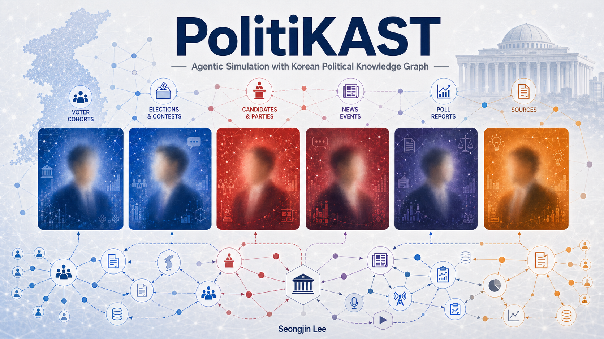

<p align="center">
  
</p>

<h1 align="center">PolitiKAST — 선거를 함께 관찰하기</h1>

<p align="center">
  <em>유권자의 자리에서, 한국 지방선거를 같이 따라가 보는 곳.</em>
</p>

<p align="center">
  <a href="docs/research-summary.md">연구 요약</a> ·
  <a href="docs/architecture.md">기술 구조</a> ·
  <a href="docs/deploy.md">셀프호스팅</a> ·
  <a href="paper/elex-kg-final.pdf">Paper (EN)</a> ·
  <a href="paper/elex-kg-final-ko.pdf">Paper (KO)</a>
</p>

---

## 무엇을 할 수 있나요?

PolitiKAST는 **2026년 한국 지방선거 다섯 곳**(서울시장 · 부산 북구갑 · 대구시장 · 광주시장 · 대구 달서갑)을
시뮬레이션으로 함께 따라가 볼 수 있는 작은 서비스입니다.

방문하신 분이 직접 해 볼 수 있는 일은 다음과 같습니다.

- 🗺️ **지역을 고르고 인구 구성을 살펴보기** — 지역별로 어떤 연령·직업·관심사의
  사람들이 모여 있는지를 보기.
- 📊 **여론조사 흐름을 시간 축으로 따라가기** — 공식 여론조사를 일자별로,
  후보별로 펼쳐 보기.
- 🧪 **시나리오 분기를 만들어 보기** — "후보가 사퇴하면?" "공천이 바뀌면?" 같은
  가정에서, KG에 사건을 주입한 채 한 번 더 시뮬레이션을 돌려 비교하기.
- 🗣️ **합성 유권자와 짧은 인터뷰** — 한 명의 가상 유권자가 어떤 이유로 누구에게
  표를 줄 것 같다고 말하는지, 자연어로 들어 보기.
- 🌐 **지식 그래프 시각화** — 후보·언론·사건·정당 사이의 연결 관계를 그래프로
  훑어 보기.
- 💬 **게시판에서 같이 이야기하기** — 닉네임으로 가볍게 의견을 남기고 다른
  분들의 시선을 읽기.

> 💡 PolitiKAST는 **선거 결과를 단언하는 도구가 아닙니다.** 같은 데이터를
> 여러 각도에서 함께 들여다보는 관찰 도구에 더 가깝습니다. 결과 화면에
> "검증 미통과(prediction-only)" 라벨이 붙어 있다면, 그건 *지금 시점에는
> 우리가 그 숫자를 자신 있게 부르지 않는다*는 뜻입니다.

---

## 처음 들어오셨다면

처음 방문하시는 분께 권하는 5분 코스입니다.

1. **지역 선택** — 다섯 지역 중 한 곳을 고릅니다 (서울이 가장 풍부합니다).
2. **인구 구성** — 그 지역에 누가 살고 있는지 살펴보세요.
3. **여론조사** — 시간 축을 따라 후보 간 격차가 어떻게 변하는지 봅니다.
4. **시나리오 분기** — 사건 하나를 추가하거나 빼면 결과가 어떻게 바뀌는지
   비교해 보세요. "이 가정 하나로 정말 이렇게 달라지나?" 가 PolitiKAST가
   가장 잘 보여주는 부분입니다.
5. **인터뷰 한 명** — 가상 유권자 한 명에게 "왜 그 후보를 골랐어요?"라고
   물어 보세요. 통계로는 안 보이는 결을 보실 수 있습니다.

---

## 어디서 만나볼 수 있나요?

| 채널 | 주소 | 비고 |
|---|---|---|
| 메인 화면 (SPA) | http://localhost:5173 | 지역 / 여론조사 / 시나리오 / 인터뷰 / 게시판 |
| 백엔드 API & Swagger | http://localhost:8080/docs | 직접 API 를 호출해 보고 싶다면 |
| Neo4j 브라우저 | http://localhost:7474 | KG 그래프를 Cypher 로 탐색 |

내 컴퓨터에서 직접 띄우고 싶으시면 → **[docs/deploy.md](docs/deploy.md)**
한 페이지로 정리해 두었습니다.

```bash
cp .env.example .env       # API 키와 비밀번호 채워주세요
make dev                   # postgres + neo4j + backend + frontend 한 번에
```

---

## 어떻게 신뢰할 수 있나요?

PolitiKAST는 "그럴듯한 숫자"보다 **"왜 그 숫자가 나오는지"** 가 더 중요하다고
생각합니다. 그래서 다음을 항상 함께 보여 드립니다.

- **검증 게이트** — 시뮬레이션 결과가 공식 여론조사(NESDC) 라벨과 충분히
  가까울 때까지는 화면에 `prediction-only` 라벨이 그대로 남아 있습니다.
- **시간 방화벽 (Temporal Information Firewall)** — 가상 유권자가 시점 *t*에
  결정을 내릴 때, 그 시점 이후에 일어난 일은 절대 알지 못합니다.
- **출처 함께 보기** — KG 안의 정치 사건은 언제·어디서 보도된 일인지가
  `source_url` 로 함께 저장됩니다. 인용 없이 만들어진 사실은 들어오지 않습니다.
- **코호트 사전 정보** — "젊으면 진보" 같은 영미식 가정 대신, 한국 갤럽 ·
  시사IN · 한국리서치 등의 실제 교차표 데이터를 그대로 사용합니다.

자세한 방법론과 수치는 → **[docs/research-summary.md](docs/research-summary.md)**

---

## 자주 묻는 질문

**Q. 여기서 본 결과가 실제 선거 결과인가요?**
아니요. PolitiKAST는 "관찰 도구" 입니다. 시뮬레이션이 NESDC 공식 폴 라벨과
충분히 일치할 때까지는 어떤 화면에서도 "예측" 이라는 단어를 쓰지 않습니다.

**Q. 가상 유권자가 한 말이 진짜 누군가의 의견인가요?**
아니요. 가상 유권자는 NVIDIA의 Nemotron-Personas-Korea 합성 데이터에서 만든
페르소나입니다. 실제 사람의 응답이 아닙니다 — 다만 "이런 배경의 사람이라면
어떤 식으로 생각할 수도 있을까?" 를 LLM 으로 풀어낸 한 표본입니다.

**Q. 게시판에 글을 남기려면 가입해야 하나요?**
아니요. 쿠키 기반 익명 닉네임이 자동으로 만들어집니다. 닉네임은 언제든
바꾸실 수 있고, 신고가 누적된 댓글은 운영자 검토 후 가려집니다. 선거일이
가까워지는 블랙아웃 기간에는 정치적 발언이 일시 제한됩니다.

**Q. 학술 논문이 따로 있나요?**
네 — 영문 33쪽([paper/elex-kg-final.pdf](paper/elex-kg-final.pdf)) /
한국어 39쪽([paper/elex-kg-final-ko.pdf](paper/elex-kg-final-ko.pdf)).

---

## 기여 / 문의

- 대화: 메인 화면 게시판에서 의견을 남겨 주세요.
- 기술적인 이슈: GitHub Issues 또는 본 저장소의 `Discussions`.
- 기여 가이드: 코드 변경 전 [docs/architecture.md](docs/architecture.md) 의
  스트림 분담 표를 한 번 읽어 주시면 충돌을 줄일 수 있습니다.
- 메일: `sjlee@bhsn.ai` (Seongjin Lee, BHSN).

---

## 인용 / 라이선스

- 코드: **MIT** (`LICENSE`).
- 합성 페르소나: **Nemotron-Personas-Korea** (NVIDIA, CC BY 4.0). 인용은 논문에
  포함되어 있습니다.
- 공식 여론조사 메타: **중앙선거여론조사심의위원회(NESDC)** 의 공개 자료를
  학술 검증 목적으로만 인덱싱했습니다. 원 출처의 권리를 존중합니다.

```bibtex
@misc{lee2026politikast,
  title  = {PolitiKAST: Political Knowledge-Augmented Multi-Agent Simulation
            of Voter Trajectories for Korean Local Elections},
  author = {Seongjin Lee},
  year   = {2026},
  note   = {12-hour hackathon prototype; arXiv submission in preparation}
}
```

---

<p align="center"><sub>Built solo as <strong>Team 기린맨</strong> · Track: AI Safety &amp; Security</sub></p>
