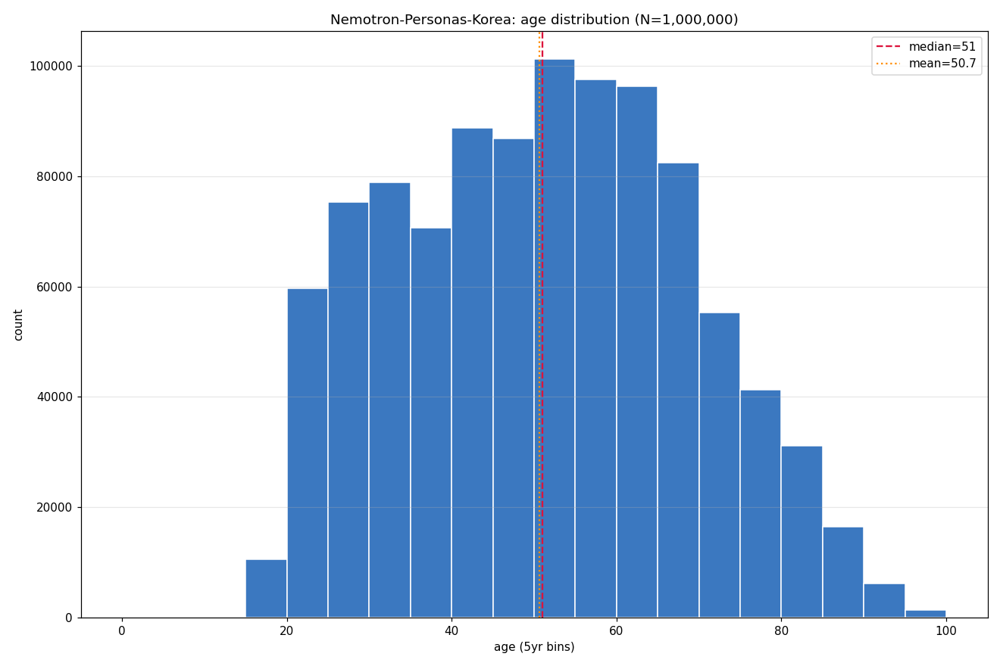
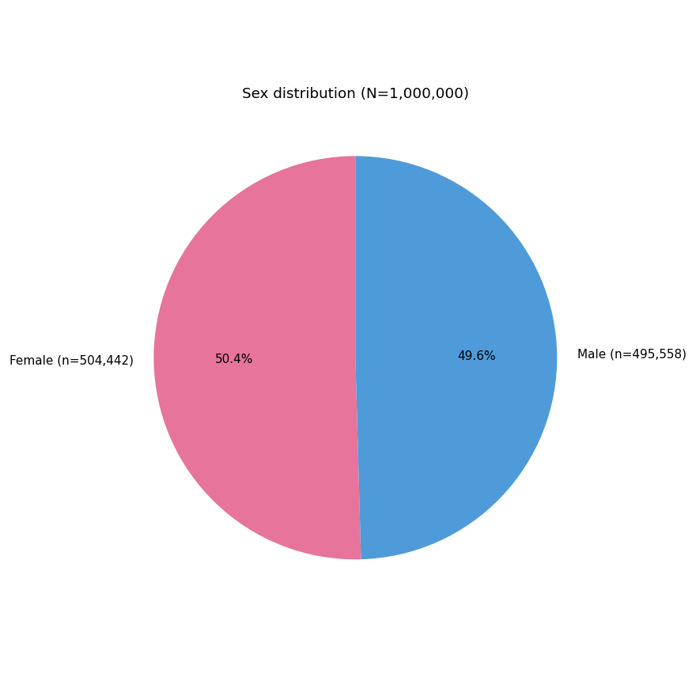
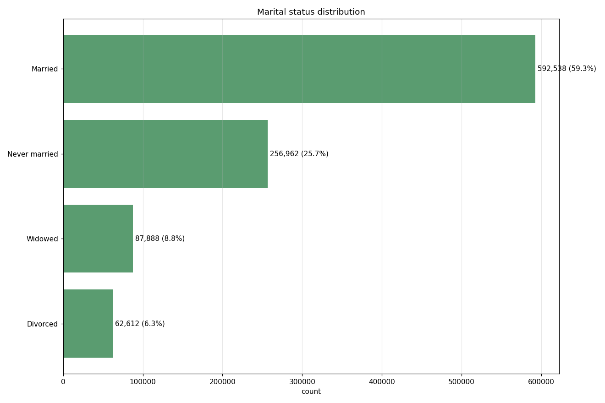
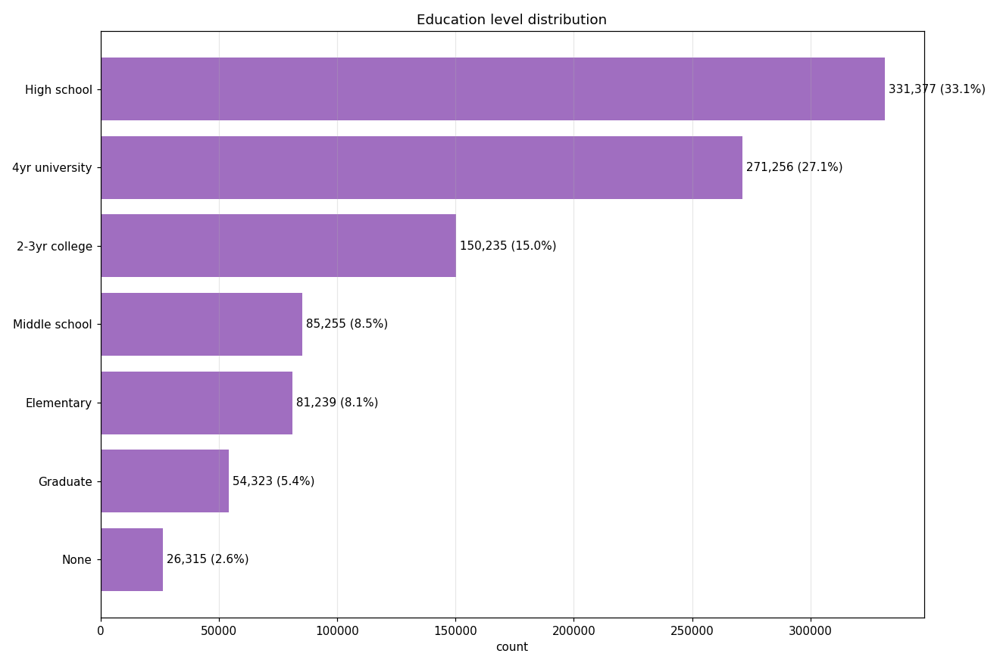
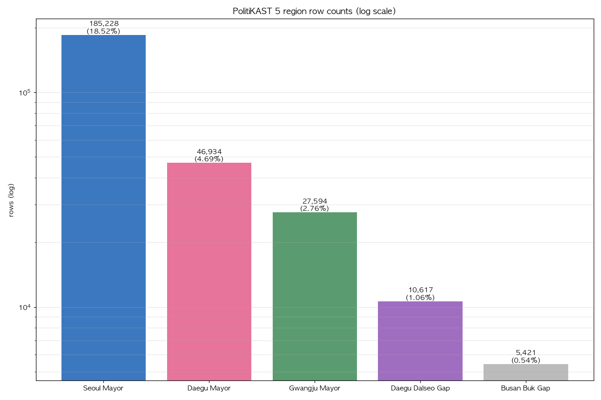
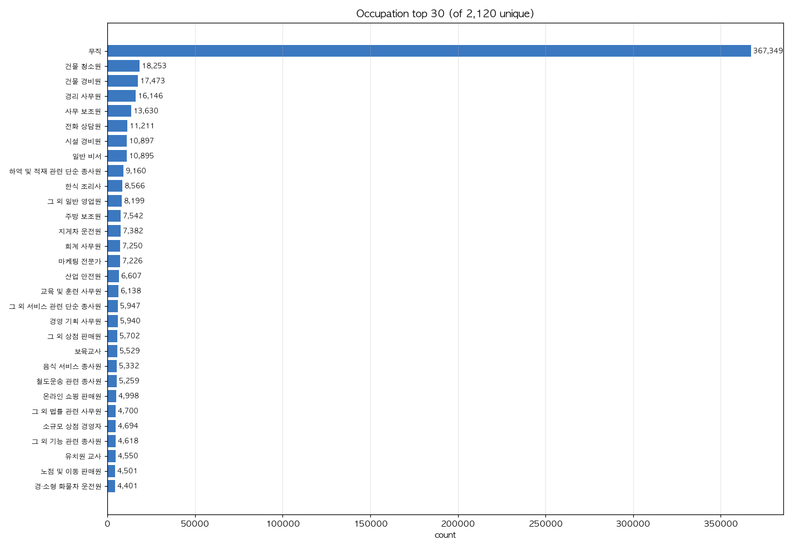
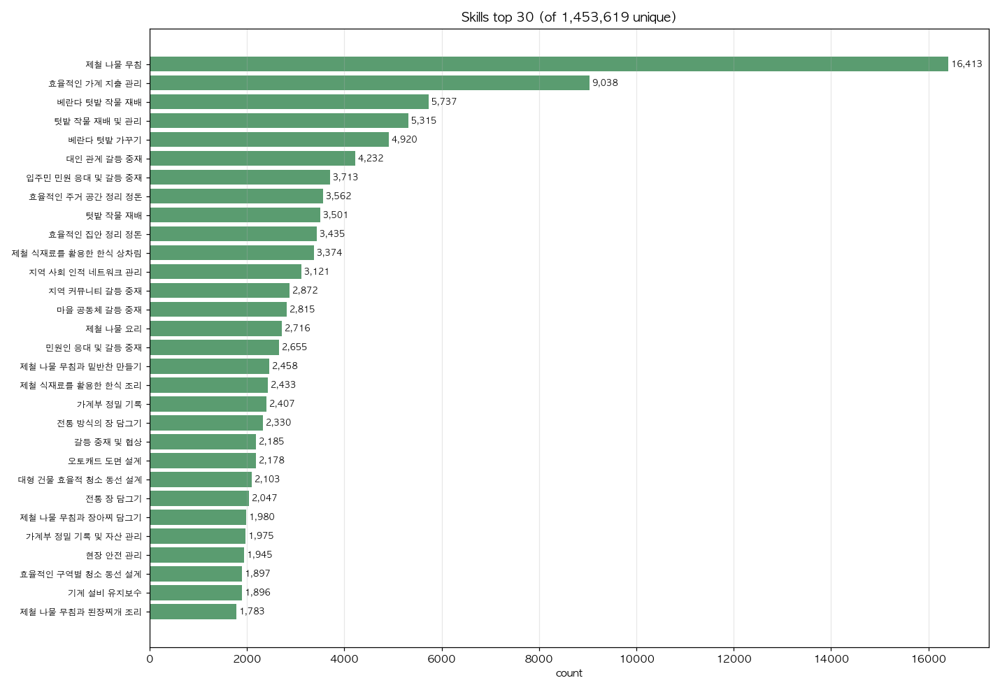
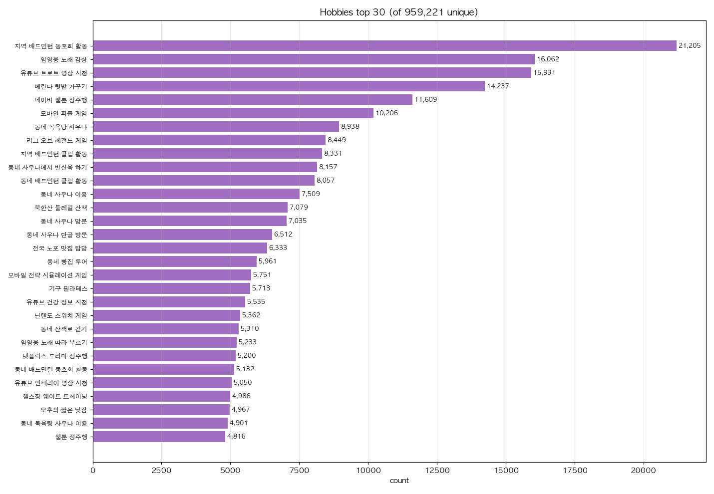
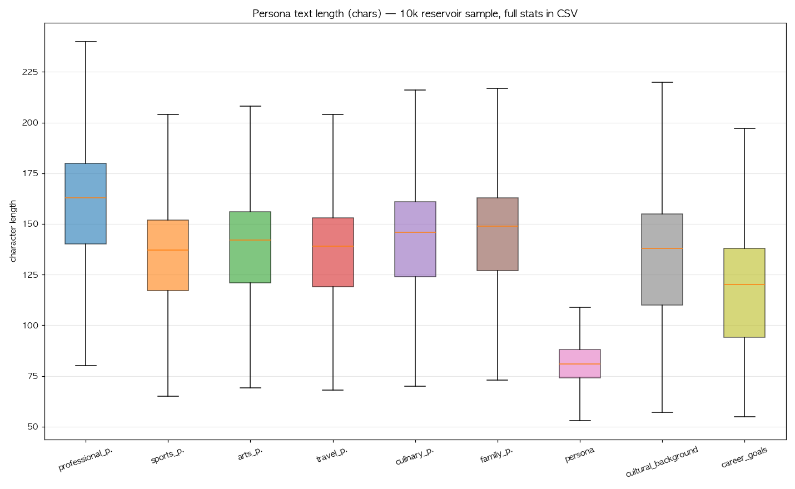

# 03. EDA 통합 — Nemotron-Personas-Korea (전수 1M)

> Task #16 — `eda-analyst`. 본 문서는 Task #11–#15 결과를 통합한 EDA 요약. 상세는 각 노트(`./notes/20_integrity.md`–`./notes/24_persona_length.md`) 및 차트/CSV(`./eda_charts/`) 참조.

## 0. 요약 (TL;DR)

| 항목 | 결과 |
|---|---|
| 행수 | **1,000,000 (9 shards × 111,111 + 1)** |
| 컬럼 | **26 (BIGINT 1, VARCHAR 25)**, schema 9 shards 동일 |
| uuid unique | ✅ 1.0M distinct, NULL 0 |
| 결측 (모든 컬럼) | **0** |
| age range | 19–99 (median 51, mean 50.7) |
| sex | 여 50.4 % / 남 49.6 % (binary only) |
| marital | 기혼 59.3 % / 미혼 25.7 % / 사별 8.8 % / 이혼 6.3 % |
| education | 7-class enum, 고졸 33 % + 4년대 27 % |
| province | 17 광역 (약칭, 비일관성 주의) |
| contract region 행수 | 서울시장 185,228 / 대구시장 46,934 / 광주시장 27,594 / 부산 북구 갑 5,421 / 대구 달서구 갑 10,617 |
| 보궐 region | **확정 반영** — `busan_buk_gap`, `daegu_dalseo_gap` |
| occupation | 2,120 unique. 1위 `무직` 36.7 % |
| skills (list) | 1.45M unique, 4 항목/행 |
| hobbies (list) | 959k unique, 4 항목/행 |
| 페르소나 텍스트 7종 길이 | median 81–163 chars, 결측 0 |

## 1. 무결성 (Task #11) — `20_integrity.md`

- 9 shards × 111,111행 (00번만 +1) = 1,000,000.
- 26 컬럼 schema 9 shards 모두 동일 (`all_match=True`).
- `uuid` VARCHAR — 1M distinct, NULL 0 → 페르소나 1차 키로 채택.
- 26 컬럼 전수 NULL 0.
- README가 광고하는 40+ 필드 대비 train split은 **26 컬럼만 노출** → schema-doc과 cross-check 필요.

## 2. 인구통계 (Task #12) — `21_demographics.md`

| 차트 | 핵심 |
|---|---|
|  | **19+만 포함**(만 18세 유권자 미커버, Limitations) |
|  | **binary only** (nonbinary 미반영) |
|  | 4-class enum (기혼 59.3 %) |
|  | 7-class ordinal (대졸 이상 32.6 %) |

→ 4개 enum은 KOSIS 카테고리와 1:1 매핑 가능, KG node attribute / DuckDB ENUM dtype 적용 가능.

## 3. 5 Region 매칭 (Task #13) — `22_region_match.md`



`province`(약칭) + `district`(`<약칭>-<시군구>[ <구>]`) 정확 매칭:

| region | n | % | 매칭 키 |
|---|---:|---:|---|
| seoul_mayor | 185,228 | 18.52 | `province='서울'` |
| daegu_mayor | 46,934 | 4.69 | `province='대구'` |
| gwangju_mayor | 27,594 | 2.76 | `province='광주'` |
| daegu_dalseo_gap | 10,617 | 1.06 | `province='대구' AND district='대구-달서구'` |
| busan_buk_gap | 5,421 | 0.54 | `province='부산' AND district='부산-북구'` |

핵심: 두 보궐 region 모두 시군구 단위로 수천~1만 명 풀을 확보한다. `daegu_dalseo_gap`은 `daegu_mayor`의 부분집합이므로 위 행수는 contest scope별 count이며 disjoint 합계가 아니다.

## 4. Occupation / Skills / Hobbies (Task #14) — `23_occupation_skills.md`

| 차트 | 핵심 |
|---|---|
|  | 2,120 unique. `무직` 36.7 % (19+ 합성 분포 정합) |
|  | 1.45M unique. 1위 `제철 나물 무침` 16,413. 텃밭/가계관리/갈등 중재 도배 |
|  | 959k unique. 1위 `지역 배드민턴 동호회 활동` 21,205. 임영웅·트로트·텃밭·사우나·LoL·웹툰 |

권고: occupation은 KSCO 대분류 roll-up 후 KG attribute. skills/hobbies는 free-form text → embedding clustering 후 KG에 반영, raw 텍스트는 voter agent prompt 그대로 inject.

## 5. 페르소나 텍스트 길이 (Task #15) — `24_persona_length.md`



- 7 도메인 페르소나 + 보조 2 필드 모두 **결측 0** (1M 전수).
- median 길이: `professional 163` > `family 149` > `culinary 146` > `arts 142` > `cultural_bg 139` > `travel 139` > `sports 137` > `career_goals 121` > `persona 81`.
- 페르소나 텍스트 7종 합산 median ≈ 957 chars ≈ 1.4–1.9k token → **voter agent system prompt 2k token 이내**(Gemini 컨텍스트 충분).

## 6. 데이터 품질 종합

| 차원 | 상태 |
|---|---|
| 완결성 | ★★★★★ (모든 필드 결측 0, uuid unique) |
| 일관성 | ★★★★☆ (province 약칭 표기 비일관 — 전북 vs 경상남) |
| 다양성 | ★★★★☆ (텍스트 free-form unique 매우 높음, 단 표면형 중복 多) |
| 한국 통계 정합 | ★★★☆☆ (sex/marital/education enum 일치, 단 age 19+ cutoff, gender binary) |
| KG 적합성 | ★★★★☆ (province/district/occupation 표준 매핑 가능, skills/hobbies는 클러스터링 필요) |

## 7. PolitiKAST 활용 권고 종합

1. **DuckDB 적재**: `read_parquet(.../*.parquet)` glob, 1.98 GB → 10–20 GB RAM 머신에서 풀 인메모리 가능. 26 컬럼 그대로 single fact table.
2. **contract region view**: `_workspace/contracts/data_paths.json` 기준으로 `personas_{region_id}` 테이블 또는 `province/district` fallback view를 사용.
3. **샘플 전략 (utility #20과 정합)**:
   - seoul/daegu/gwangju → stratified down-sample (각 region에서 sex × age × education × marital 균등).
   - busan_buk_gap / daegu_dalseo_gap → district-level sample. 보궐 contest와 광역 contest가 겹치는 경우 uuid 중복 관리를 명시.
4. **voter agent prompt**: `professional_persona + family_persona + persona`(가장 정보 밀도 높음) + `career_goals` + skills/hobbies 4 항목 inject ≈ 1.5k token / agent.
5. **KG 노드/엣지**(utility #19와 cross-ref):
   - Node: `Persona(uuid)`, `Region(province, district)`, `Occupation(KSCO 대분류)`, `EducationLevel`, `MaritalStatus`, `AgeBucket`.
   - Edge: persona →lives_in→ region; persona →employed_as→ occupation; persona →interested_in→ hobby_cluster; persona →skilled_in→ skill_cluster.
6. **Limitations(paper)**:
   - age 19+ (만 18세 유권자 미포함).
   - gender binary only.
   - 보궐 district-level region의 표본 크기와 `daegu_mayor`/`daegu_dalseo_gap` scope overlap.
   - skills/hobbies 표면형 중복 → 클러스터링 의존.

## 8. 산출물 인덱스

```
notes/
  20_integrity.md           — 무결성·schema·uuid
  21_demographics.md        — age/sex/marital/education
  22_region_match.md        — 5 region rowcount
  23_occupation_skills.md   — occupation/skills/hobbies top
  24_persona_length.md      — 페르소나 텍스트 길이/결측
  03_eda.md                 — (이 문서) 통합 요약
eda_charts/
  age_hist.png  sex_pie.png  marital_bar.png  education_bar.png
  region_match_bar.png
  occupation_top.png  skills_top.png  hobbies_top.png
  persona_length.png
  _data/                    — 차트 원본 CSV/JSON (재현 가능)
scripts/
  _font.py                  — Korean font (AppleGothic) helper
  integrity_check.py        — Task #11
  demographics.py           — Task #12
  region_match.py           — Task #13
  occupation_skills.py      — Task #14
  persona_length.py         — Task #15
```

재현 (전체) — 모든 스크립트는 PEP 723 inline metadata 보유, `uv run`이 의존성 자동 해결:

```
cd _workspace/research/nemotron-personas-korea
uv run scripts/integrity_check.py
uv run scripts/demographics.py
uv run scripts/region_match.py
uv run scripts/occupation_skills.py
uv run scripts/persona_length.py
```

요구 환경: `uv` (Python 가상환경 매니저), macOS AppleGothic (Korean font, 차트 라벨용). 시스템 python에 패키지 설치 불필요.
