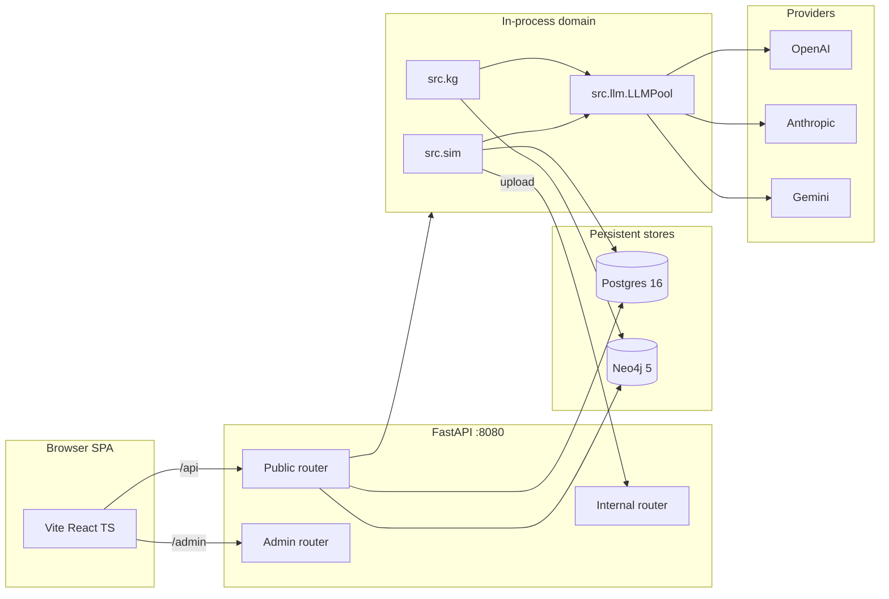

# PolitiKAST — Architecture

> Phase 4+5 의 시스템 구조를 한 페이지에 요약합니다. 코드를 처음 만지기 전에
> 읽어 주시면 다른 스트림 산출물과 충돌을 피하실 수 있습니다.

## 1. 큰 그림

```
                          ┌──────────────────────────────┐
                          │          사용자 (Web)          │
                          └──────────────┬───────────────┘
                                         │ HTTP(S)
                          ┌──────────────▼───────────────┐
                          │ Vite + React + TS  SPA       │
                          │  frontend/                   │  :5173
                          │  - Region / Trajectory /     │
                          │    Scenario / KG / Board     │
                          └──────────────┬───────────────┘
                                         │ /api  (proxy)
                          ┌──────────────▼───────────────┐
                          │ FastAPI (Async)              │
                          │  backend/app/                │  :8080
                          │  - public / admin / internal │
                          │  - service token + JWT auth  │
                          └──┬───────────┬─────────────┬─┘
                             │           │             │
              SQLAlchemy 2.x │           │ Cypher      │ asyncio
              ┌──────────────▼──┐  ┌─────▼──────┐ ┌────▼────────────┐
              │   Postgres 16   │  │   Neo4j 5  │ │ Domain (in-proc)│
              │ politikast pool │  │ KG mirror  │ │ src/sim, src/kg │
              │ - polls / runs  │  │ - labels   │ │ - VoterAgent    │
              │ - personas / GT │  │ - rels     │ │ - ElectionEnv   │
              │ - community     │  │ - ts gates │ │ - LLMPool       │
              └─────────────────┘  └────────────┘ └────────┬────────┘
                                                          │  LiteLLM
                                              ┌───────────▼──────────┐
                                              │ OpenAI / Gemini /    │
                                              │ Anthropic providers  │
                                              └──────────────────────┘
```



## 2. 스트림 분담 (코드 owner 표)

| 스트림 | 담당 디렉토리 | 산출물 | 비고 |
|---|---|---|---|
| backend | `backend/app/` | FastAPI 앱, 인증, 라우터 | OpenAPI export 는 `make openapi-export` |
| db-postgres | `backend/app/db/`, `alembic/`, `tools/migrate_duckdb_to_postgres.py` | SQLAlchemy 2.x async, Alembic 마이그레이션 | `make migrate-db` |
| kg-neo4j | `src/kg/`, `backend/app/db/neo4j_session.py`, `tools/migrate_networkx_to_neo4j.py` | networkx 빌드 + Cypher 미러 | scenario > staging 정책 유지 |
| ingestion | `src/ingest/`, `src/ingest/adapters/` | NESDC / NEC / news / Perplexity 어댑터 | `make ingest` / `make ingest-dryrun` |
| simulation | `src/sim/` | VoterAgent / ElectionEnv / poll consensus / counterfactual | LiteLLM 백엔드 |
| eval | `src/eval/`, `tests/eval/` | Brier / ECE / KL / JS / collapse 분석 | 검증 게이트 |
| frontend | `frontend/` | Vite React TS, 게시판 / KG 시각화 | OpenAPI 클라이언트 codegen |
| docs | `README.md`, `docs/`, `tests/test_readme_links.py` | 톤 일관성 + 링크 게이트 | Phase 5 |

## 3. 데이터 흐름

### 3.1 인입 (ingestion)

```
NESDC / NEC / News / Perplexity
        │
        ▼
src/ingest/adapters/*.py   ── ParseResult(rows)
        │
        ▼
stg_raw_poll / stg_raw_poll_result / stg_kg_triple   (Postgres staging, 멱등)
        │
        ├─► (poll) MERGE → raw_poll / poll_consensus_daily
        └─► (KG) staging_loader.py → networkx graft (scenario > staging)
```

- 모든 stg_* 테이블 INSERT 는 `(run_id, …)` 복합 PK 로 ON CONFLICT DO NOTHING.
- `EntityResolver` (`src/ingest/resolver.py`) 가 alias → canonical entity id
  를 풀어 unresolved 큐를 비웁니다.

### 3.2 시뮬레이션

```
시나리오 + 페르소나 풀 + KG  ─►  ElectionEnv (T timesteps)
                                  │
                                  ▼
                              VoterAgent.vote()
                                  │
                                  ▼
                              Poll Consensus
                                  │
                                  ▼
                          secret-ballot tally
                                  │
                                  ▼
                          result JSON (snapshots/)
```

KG retrieve 는 **Temporal Firewall** 을 통과해야 voter prompt 에 들어갑니다 —
시점 *t* 에 보이는 사실은 항상 `ts ≤ cutoff_for(region, t)` 만 입니다
(`src/kg/firewall.py`).

### 3.3 시각화 / 사용자 대화

- 사용자는 SPA 의 시나리오 페이지에서 분기를 만들고, backend 의
  `/api/scenarios/{id}/branch` 가 백엔드 측에서 `src.sim.run_counterfactual`
  을 트리거합니다.
- 게시판 / 댓글은 `comment_service` / `board_service` 가 처리하며, 익명
  쿠키 닉네임은 `anon_user_service` 가 발급합니다.
- 블랙아웃 기간(공직선거법 §108)에는 `BlackoutBanner` + 정치 발언 일시 정지.

## 4. 도메인 인터페이스 약속

다음 시그니처는 **모든 phase 에서 보존**됩니다 (다른 스트림이 의존):

```python
# src/kg/builder.py
build_kg_from_scenarios(...)           -> (MultiDiGraph, ScenarioIndex)
build_with_staging(scenario_dir, db_path=None, region_id=None) -> (MultiDiGraph, ScenarioIndex)
build_for_region(region_id, cutoff=None, db_path=None) -> MultiDiGraph

# src/kg/retriever.py
KGRetriever.subgraph_at(persona, t, region_id, k=5) -> RetrievalResult
KGRetriever.cutoff_for(region_id, t) -> datetime | None
make_retriever(db_path=None, region_id=None) -> KGRetriever

# src/kg/firewall.py
assert_no_future_leakage(retriever, persona, t, region_id, k=5) -> RetrievalResult
assert_staging_triples_well_formed(g) -> int

# src/sim/election_env.py
ElectionEnv.__init__(..., kg=...)      # accepts retriever, _NullRetriever, or None
```

도메인 호출자(예: `src/sim/election_env.py`)는 백엔드(networkx vs Neo4j)와
무관하게 위 시그니처만 사용합니다.

## 5. 환경 변수 (요약)

| 변수 | 의미 | 기본값 |
|---|---|---|
| `POLITIKAST_ENV` | dev / prod | dev |
| `POLITIKAST_LLM_CACHE` | LLM 캐시 사용 여부 | 1 |
| `POLITIKAST_FINAL_POLL_FEEDBACK` | 최종 polling feedback loop | 0 |
| `POLITIKAST_KG_USE_STAGING` | staging triple 합성 | 0 |
| `POLITIKAST_KG_STRICT` | KG Pydantic 미러 검증 | 0 |
| `POLITIKAST_REGISTRY_DIR` | registry 디렉토리 override | `_workspace/data/registries/` |
| `POLITIKAST_API_NEO4J_URI` | Neo4j URI | _(unset → networkx fallback)_ |
| `POLITIKAST_PG_DSN` | Postgres DSN | _(필수, prod)_ |
| `OPENAI_API_KEYS` / `ANTHROPIC_API_KEYS` / `GEMINI_API_KEYS` | LLM 키 | _(prod 필수)_ |

전체 목록은 `.env.example` 가 SoT 입니다.

## 6. 단일 진실의 출처 (SoT)

```
_workspace/contracts/*.json        ── 런타임 컨트랙트
_workspace/data/registries/*.json  ── 컨트롤드 보캐뷸러리
src/schemas/*.py                   ── Pydantic 미러 (검증)
   └── make schema-export ─► _workspace/contracts/jsonschema/
```

| Registry | Pydantic SoT | Loader |
|---|---|---|
| `election_calendar.json` | `src.schemas.calendar.ElectionCalendar` | `load_election_calendar()` |
| `parties.json` | `src.schemas.party.PartyRegistry` | `load_party_registry()` |
| `age_buckets.json` | `src.schemas.cohort.AgeBuckets` | `load_age_buckets()` |
| `pollsters.json` | `src.schemas.pollster.PollsterRegistry` | `load_pollster_registry()` |
| `persona_axes.json` | `src.schemas.persona_axis.PersonaAxisRegistry` | `load_persona_axes()` |

새 registry 를 추가하실 때 — ① `src/schemas/<name>.py` 에 Pydantic + `load_<name>()`. ② `__init__.py` re-export. ③ `_workspace/data/registries/<name>.json` 작성. ④ `scripts/export_jsonschema.py::EXPORTS` 등록. ⑤ `_workspace/data/registries/README.md` 표 갱신. ⑥ `make schema-export && make test` 통과 확인.

## 7. 더 자세한 자료

- 검증 / 결과 / 한계 — [research-summary.md](research-summary.md)
- 셀프호스팅 / 운영 — [deploy.md](deploy.md)
- 인입 어댑터 패턴 — [adapters.md](adapters.md)
- Paper (학술 톤, 33쪽 EN / 39쪽 KO) — [`paper/elex-kg-final.pdf`](../paper/elex-kg-final.pdf)
- API 명세 (OpenAPI 3.x) — `make openapi-export` → `_workspace/contracts/openapi.json`
